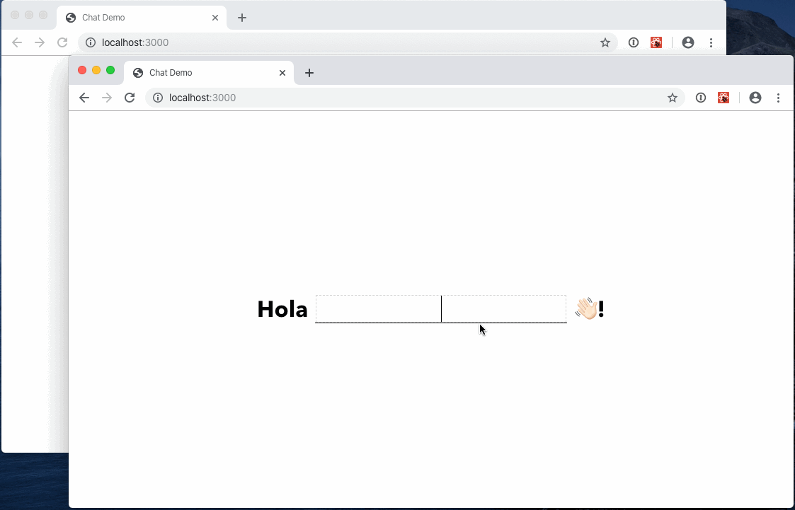

# DevNights Chat PoC



Basado en la buena idea de [@ZeroDragon](https://github.com/ZeroDragon).

Un chat basico con Socket.io en el back y React en el front.

## Setup

```
git clone git@github.com:eruizdechavez/devnights-chat-poc.git
cd devnights-chat-poc
npm install
npm start
```

## To Do

- [x] MVP: Chat con Socket.io 🎉
- [ ] Auth0 🔐
- [ ] Cambiar nick ✏️
- [ ] Log out 🚪
- [ ] Estilos 🎨
- [ ] Cargar historial 🗄
- [ ] Exportar historial 📦
- [ ] Notificaciones 📫
- [ ] Broadcast de imágenes en modo PiP 🖼
- [ ] Hot reload `server.js` 🔥
